# Jarkom Modul 1 K24 2025

### Kelompok K24
| Nama                                  |    NRP      |
|---------------------------------------|-------------|
| Muhammad Ahsani Taqwiim Rakhman       | 5027241099  |
| Oryza Qiara Ramadhani                 | 5027241084  |

## Laporan Resmi Jarkom Modul 1 K24

1. pembuatan topologi 

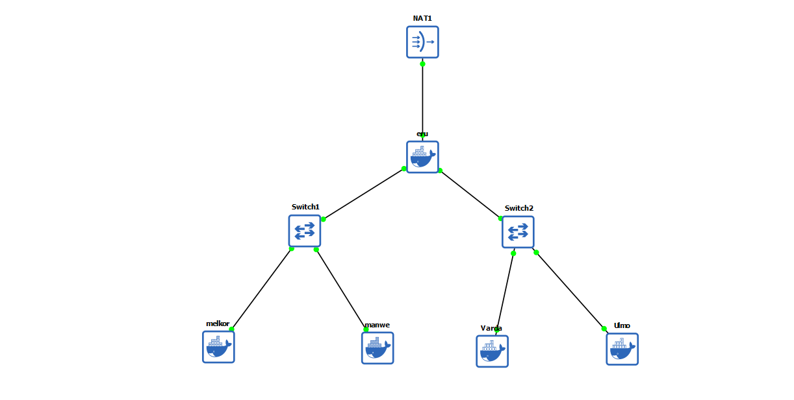

Eru yang berperan sebagai Router membuat dua Switch/Gateway. Dimana Switch 1 akan menuju ke dua Ainur yaitu Melkor dan Manwe. Sedangkan Switch 2 akan menuju ke dua Ainur lainnya yaitu Varda dan Ulmo. Keempat Ainur tersebut diberi perintah oleh Eru untuk menjadi Client.

2. Eru pada saat itu Arda (Bumi) masih terisolasi dengan dunia luar, maka buat agar Eru dapat tersambung ke internet.

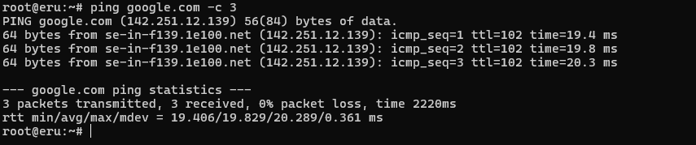

Dari sini dapat dilihat bahwa setelah dilakukan ping kepada google.com memandakan bahwa eru dapat tersambung dengan internet

3. Setiap Ainur (Client) dapat terhubung satu sama lain

Pada setiap config client diberi tambahan `echo "nameserver 192.168.122.1" > /etc/resolv.conf` dengan konfigurasi ini, setiap client dapat berkomunikasi lintas subnet melalui Router.

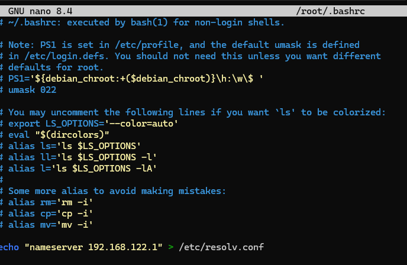

nah dari sini itu dicoba nge ping dari melkor ke varda ` ping -c 4 192.223.2.2 `

4. Memastikan agar setiap Client dapat tersambung ke internet 

lakukan `ping google.com -c 3` pada semua client agar memastikan semua tersambung ke internet

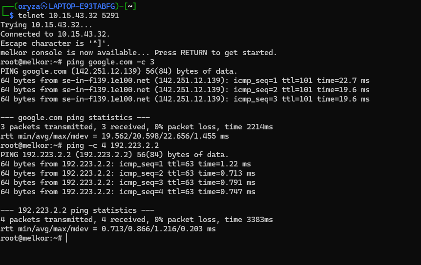

5. Eru dan para Ainur lainnya meminta agar semua konfigurasi tidak hilang saat semua node di restart.

Dengan menambahkan 
`# root eru `
`apt update && apt install -y iptables`
`iptables -t nat -A POSTROUTING -s 192.223.0.0/16 -o eth0 -j MASQUERADE`
`echo "nameserver 192.168.122.1" > /etc/resolv.conf`

Biar konfigurasi nggak hilang setelah restart, IP static ditulis di /root/.bashrc , aturan NAT disimpan pakai iptables-persistent, IP forwarding diaktifin lewat /etc/resolv.conf, dan DNS juga diset supaya client tetap bisa internetan.

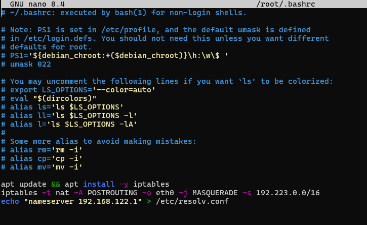

6. Melkor Menyusup dengan mengnalisis Paket Komunikasi Manwe dan Eru dengan Wireshark

Dimulai dengan mengunduh file traffic.zip di client melkor dan kemudian menjalankan file tersebut setelah di ekstrak `./traffic.sh`  Lalu jalankan capture agar file dianalisis di wireshark dan setelah itu semua paket bisa di jadikan dalam satu file `nomor6.pcapng` 

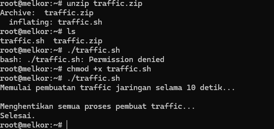

7. Konfigurasi FTP Server pada Node Eru

Untuk meningkatkan keamanan, Eru membuat sebuah FTP Server di node miliknya menggunakan vsftpd. Kali ini diminta untuk membuat user baru yaitu
- ainur → memiliki hak akses write & read ke direktori /srv/ftp/shared.
- melkor → tidak memiliki hak akses sama sekali.

Dari screenshot di bawah ini itu menunjukkan bagaimana perbandingan dari dua user yang dimana ada yang bisa melakukan `put cobalagi.txt` dan apabila tidak bisa maka user tidak akan bisa untuk login ftp.

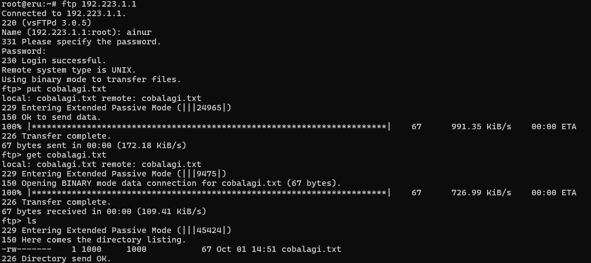
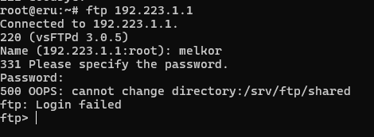

8. Ulmo Mengirimkan Data Ramalan Cuaca ke Eru via FTP

Ulmo sebagai penjaga perairan perlu mengirimkan data ramalan cuaca ke node Eru melalui FTP Server yang sudah dikonfigurasi sebelumnya. Pada proses ini Ulmo bertindak sebagai FTP Client, sedangkan Eru sebagai FTP Server.

Langkah yang dilakukan yaitu mengunduh file cuaca.zip, mengekstraknya, lalu melakukan koneksi ke FTP Server Eru dengan user ainur yang memiliki hak akses penuh. Setelah login berhasil, file cuaca.txt dan mendung.jpg diunggah ke direktori FTP menggunakan perintah put.

Screenshot di bawah ini menunjukkan proses upload file berhasil dilakukan menggunakan user ainur.

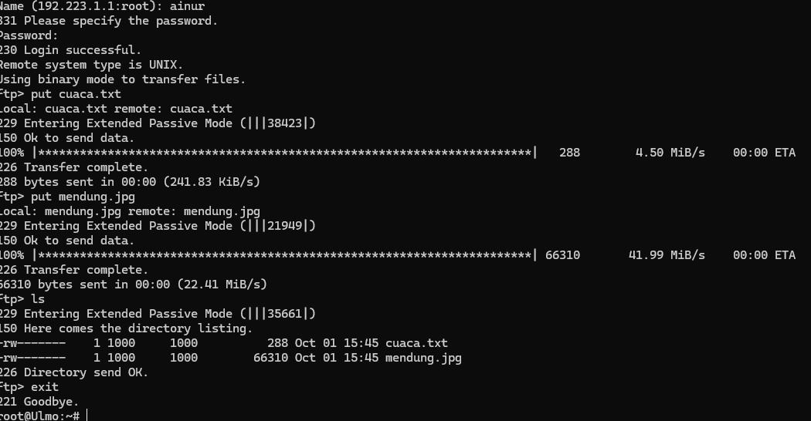

9. 

10. 
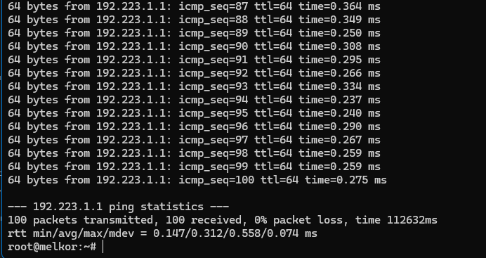

### 11. 
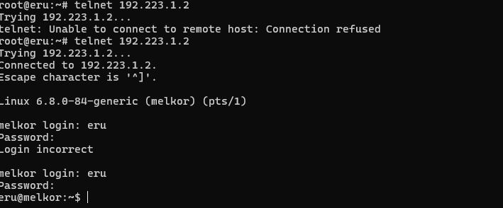

### 14.
1.How many packets are recorded in the pcapng file?

bisa kita liat berapa banyak packet, di paling bawah packet jawaban:`500358`
2.What are the user that successfully logged in?

kita filter dengan mencari stream yang ada succesnya

bisa kita follow tcp stream melihat username dan password jawaban:`n1enna:y4v4nn4_k3m3nt4r1`
3.In which stream were the credentials found?

bisa diliat diatas tcp.stream eq jawaban:`41284`

### 15.
1.What device does Melkor use?

di HID data terlihatseperti keyboard jawaban:`Keyboard`
2.What did Melkor write?

pertama kita filter modus length yang ada di pcap yaitu 35, dan kita export menjadi csv

kedua kita membuat script phyton untuk mendecode Hid yang sudah kita export
```
import csv
  import sys

class HIDDecoder:
    def _init_(self):
        # USB HID to Character Mapping
        self.hid_map = {
            '04': 'a', '05': 'b', '06': 'c', '07': 'd', '08': 'e', '09': 'f', '0a': 'g',
            '0b': 'h', '0c': 'i', '0d': 'j', '0e': 'k', '0f': 'l', '10': 'm', '11': 'n',
            '12': 'o', '13': 'p', '14': 'q', '15': 'r', '16': 's', '17': 't', '18': 'u',
            '19': 'v', '1a': 'w', '1b': 'x', '1c': 'y', '1d': 'z', '1e': '1', '1f': '2',
            '20': '3', '21': '4', '22': '5', '23': '6', '24': '7', '25': '8', '26': '9',
            '27': '0', '28': '\n', '2c': ' ', '2d': '-', '2e': '=', '2f': '[', '30': ']',
            '31': '\\', '33': ';', '34': "'", '35': '`', '36': ',', '37': '.', '38': '/'
        }
        
        # Shifted characters
        self.shift_map = {
            '1e': '!', '1f': '@', '20': '#', '21': '$', '22': '%', '23': '^', '24': '&',
            '25': '*', '26': '(', '27': ')', '2d': '_', '2e': '+', '2f': '{', '30': '}',
            '31': '|', '33': ':', '34': '"', '35': '~', '36': '<', '37': '>', '38': '?'
        }

    def decode_hid_data(self, hid_hex):
        """Decode single HID data packet to character"""
        if not hid_hex or hid_hex == '00:00:00:00:00:00:00:00':
            return None
            
        clean_data = hid_hex.replace(':', '')
        if len(clean_data) < 16:
            return None
            
        modifier = int(clean_data[0:2], 16)
        key1 = clean_data[4:6]
        
        if key1 == '00':
            return None
            
        # Check if shift is pressed
        is_shift = modifier in [2, 32, 34]
        
        if is_shift:
            char = self.shift_map.get(key1, self.hid_map.get(key1, f'[0x{key1}]').upper())
        else:
            char = self.hid_map.get(key1, f'[0x{key1}]')
            
        return char

    def decode_csv_file(self, csv_file):
        """Decode HID data from CSV file"""
        decoded_text = ""
        packet_count = 0
        decoded_count = 0
        
        print("HID Data Decoder")
        print("=" * 60)
        
        try:
            with open(csv_file, 'r', newline='', encoding='utf-8') as file:
                reader = csv.DictReader(file)
                
                for row in reader:
                    packet_count += 1
                    hid_data = row.get('HID Data', '').strip()
                    
                    if hid_data:
                        char = self.decode_hid_data(hid_data)
                        if char:
                            decoded_text += char
                            decoded_count += 1
                            print(f"Packet {packet_count}: {hid_data} -> '{char}'")
                
        except FileNotFoundError:
            print(f"Error: File '{csv_file}' not found!")
            return None
        except Exception as e:
            print(f"Error reading CSV file: {e}")
            return None
            
        print("=" * 60)
        print(f"Statistics:")
        print(f"  Total packets processed: {packet_count}")
        print(f"  Packets with keystrokes: {decoded_count}")
        print(f"  Decoded text length: {len(decoded_text)} characters")
        print("=" * 60)
        print(f"DECODED TEXT: {decoded_text}")
        print("=" * 60)
        
        return decoded_text

    def decode_from_list(self, hid_list):
        """Decode from list of HID data strings"""
        decoded_text = ""
        
        print("Decoding from HID data list...")
        print("=" * 60)
        
        for i, hid_data in enumerate(hid_list, 1):
            char = self.decode_hid_data(hid_data)
            if char:
                decoded_text += char
                print(f"Item {i}: {hid_data} -> '{char}'")
        
        print("=" * 60)
        print(f"DECODED TEXT: {decoded_text}")
        
        return decoded_text

def main():
    decoder = HIDDecoder()
    
    print("USB HID Data Decoder")
    print("1. Decode from CSV file")
    print("2. Decode from direct input")
    
    choice = input("Choose option (1 or 2): ").strip()
    
    if choice == "1":
        csv_file = input("Enter CSV filename: ").strip()
        decoder.decode_csv_file(csv_file)
    
    elif choice == "2":
        print("Paste HID data (one per line, empty line to finish):")
        hid_list = []
        while True:
            line = input().strip()
            if not line:
                break
            hid_list.append(line)
        
        decoder.decode_from_list(hid_list)
    
    else:
        print("Invalid choice!")

if _name_ == "_main_":
    main()
```
habis itu kita decrypt csvnya

jawaban: `UGx6X3ByMHYxZGVfeTB1cl91czNybjRtZV80bmRfcDRzc3cwcmQ=`
3.What is Melkor's secret message?

karena terlihat = maka ini adalah base64, dengan itu tinggal di decode jawaban: `Plz_pr0v1de_y0ur_us3rn4me_4nd_p4ssw0rd`

### 16.
1.What credential did the attacker use to log in?

karena kita disuruh mecari username dan login , maka kita filter dengan user

dan kita tcp stream dan mendapatkan username dan password jawaban: `ind@psg420.com:{6r_6e#TfT1p`
2.How many files are suspected of containing malware?

dari tcpstream tersebut kita bisa menghitung malware yang ada yaitu .exe jawaban:`5`
3.What is the hash of the first file (q.exe)?

pertama kita tcpstream tpf-data karena artinya itu adalah paket yang mengtransfer data, juga cari dengan length yang paling besar

terus kita buat raw dan save

dan kita buat file raw itu menjadi sha256 jawaban: `ca34b0926cdc3242bbfad1c4a0b42cc2750d90db9a272d92cfb6cb7034d2a3bd`
4.What is the hash of the second file (w.exe)?
lakukan sama seprti no 3 tetapi w.exe

jawaban:`08eb941447078ef2c6ad8d91bb2f52256c09657ecd3d5344023edccf7291e9fc`
5.What is the hash of the third file (e.exe)?
lakukan sama seprti no 3 tetapi e.exe

jawaban:`32e1b3732cd779af1bf7730d0ec8a7a87a084319f6a0870dc7362a15ddbd3199`
6.What is the hash of the fourth file (r.exe)?
lakukan sama seprti no 3 tetapi r.exe

jawaban:`4ebd58007ee933a0a8348aee2922904a7110b7fb6a316b1c7fb2c6677e613884`
7.What is the hash of the fifth file (t.exe)?
lakukan sama seprti no 3 tetapi t.exe

jawaban:`10ce4b79180a2ddd924fdc95951d968191af2ee3b7dfc96dd6a5714dbeae613a`

### 17.
1.What is the name of the first suspicious file?

setelah mengetahui yang exe ada hanya knr tetapi bukan jawabannya kita lihat di export http yang ada knr.exe, dan yang bisa ada file doc jawaban:`Invoice&MSO-Request.doc`
2.What is the name of the second suspicious file?

sekarang kita pakai knr.exe jawaban:`knr.exe`
3.What is the hash of the second suspicious file (knr.exe)?

pertama kita download terlebih dahulu

langsung saja jadikan sha256 jawaban:`749e161661290e8a2d190b1a66469744127bc25bf46e5d0c6f2e835f4b92db18`

###18.
1.How many files are suspected of containing malware?

filter .exe bertemu 2 file execute jawaban: `2`
2.What is the name of the first malicious file?
jawaban: `d0p2nc6ka3f_fixhohlycj4ovqfcy_smchzo_ub83urjpphrwahjwhv_o5c0fvf6.exe`
3.Apa nama file berbahaya yang kedua?
jawaban: `oiku9bu68cxqenfmcsos2aek6t07_guuisgxhllixv8dx2eemqddnhyh46l8n_di.exe`
4.What is the hash of the first malicious file?

save file pertama dan  buat sdh256 jawaban:`59896ae5f3edcb999243c7bfdc0b17eb7fe28f3a66259d797386ea470c010040`
5.What is the hash of the second malicious file?

save file kedua dan buat sdh256 jawaban:`cf99990bee6c378cbf56239b3cc88276eec348d82740f84e9d5c343751f82560`

###19.
1.Who sent the threatening message?

karena yang mail from hanya dari Yourlife jawaban:`Your Life`
2.How much ransom did the attacker demand ($)?

dari tcpstream seorang recipient jawaban:`1600`
3.What is the attacker's bitcoin wallet?

dari tcpstream yang sama jawaban:`1CWHmuF8dHt7HBGx5RKKLgg9QA2GmE3uyL`

###20.


    


